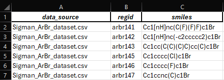
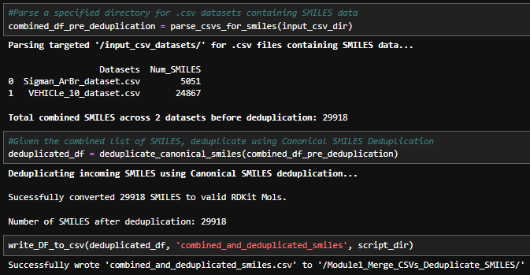

### 'CSV_combiner.ipynb' - @GCH v1.0 - last updt. 05/09/2026

### Notebook Overview:
This notebook contains code to combine and deduplicate SMILES data from multiple incoming .csvs containing a column
of 'SMILES' data. The general flow of the program is as follows:
1. Search specified directory for .csv files containing a column named "SMILES" (any capitalization)
2. From the list of all SMILES, try to convert each SMILE to an RDKit Mol object; omit failed SMILES
3. Convert deduplicated SMILES into Canonical SMILES using RDKit
4. Peform string-based deduplication using Canonical SMILES
5. Output a deduplicated .csv of SMILES and their data source/ID info to a specified output directory

### Motivation:
A simple and expandable script to parse .csv files for 'SMILES' data / simple deduplication

### How to Use this Notebook: 
1. Define relevant Paths to output files in the PATH cell below
2. Run all cells in the notebook

### Output .csv Format:

### Example Notebook Output: 

---

<!-- nav-footer -->
Next: [Module 2 — Prepare Arene Cores](../Module2_Prepare_Arene_Cores/README.md) ➡
