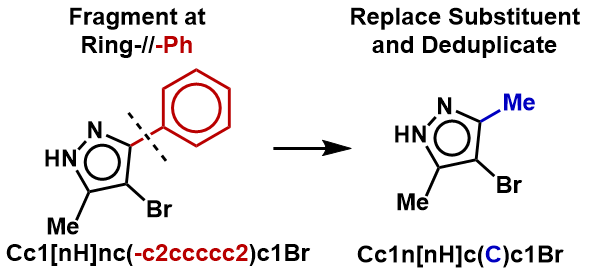
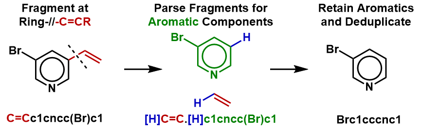
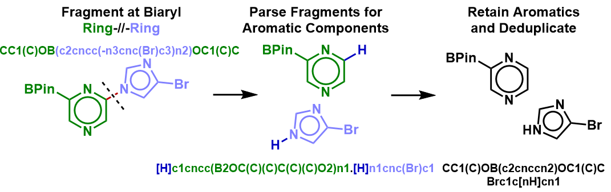
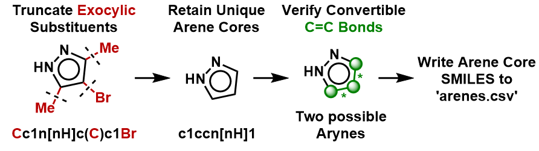
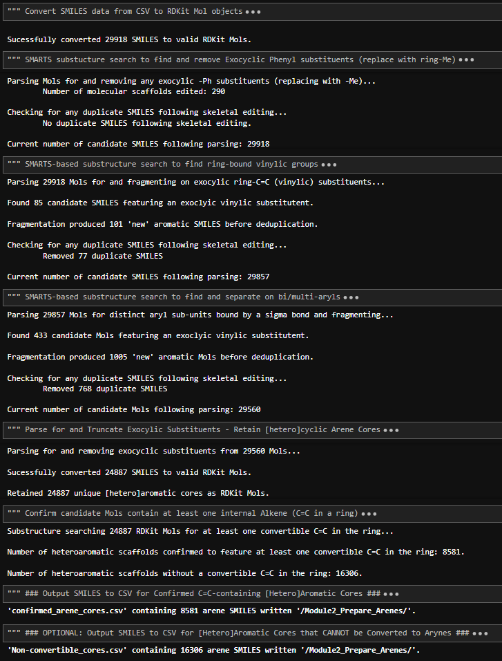
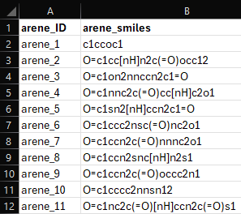

### 'Prepare_Arene_Cores.ipynb' - @GCH v1.0 - last updt. 04/20/2026

### Notebook Overview:
This notebook contains code to pre-parse incoming raw SMILES data to ensure all incoming SMILES data are valid and chemically 
relevant. In simpler words, this is a project-specific Notebook to ensure we have a self-consistent set of arene cores suitable
for conversion to arynes via Reaction SMARTS. Cells in this notebook rely on SMARTS-based substructure searches/skeletal 
editing to generate a set of unique arene cores that contain at least one C=C double bond convertible to a C#C triple bond.
Following rough skeletal editing to produce the maximal set of possible [hetero]arene precursors, we next remove any/all 
remaining exocylic substituents to consider the aromatic core, only. A final deduplication pass results in a set of unique and
aryne-convertible arene precurors in SMILES format. 

### Specifically, the following checks/edits are performed on each incoming SMILES string:
1. Attempt to generate a valid/sanitized RDKit Mol object; drop invalid mols
   
2. Apply SMARTS-based substructure search for exocylic -Ph substituents; replace ring-Ph with ring-CH3 (R-Me). Deduplicate.

3. Apply SMARTS-based substructure search for vinylic substituents ring-C=C-R; Fragment to generate ring-CH3 and HC-R
   (and any additional fragments if mutiple vinylic couples). Search for and retain fragments with aromatic ring
   subunits. Deduplicate.
   

5. Apply SMARTS-based substructure search for biaryl subunits (ex: Ar-Ar); Fragment at the biaryl sigma bond indices to
   generate distinct ring systems; deduplicate
   

7. Perform an explicit check for the presence of at least one C=C double bond within the ring that is convertible to
    a C#C triple bond
   

### Motivation:
A mandatory and thorough pre-parsing of SMILES data to ensure that we are only considering valid heterocycles in our database.

### How to Use this Notebook: 
1. Define relevant Paths to output files in the PATH cell below
2. Run all cells in the notebook

### Example Notebook Output: 

### Output .csv Containing Confirmed Arene SMILES:

