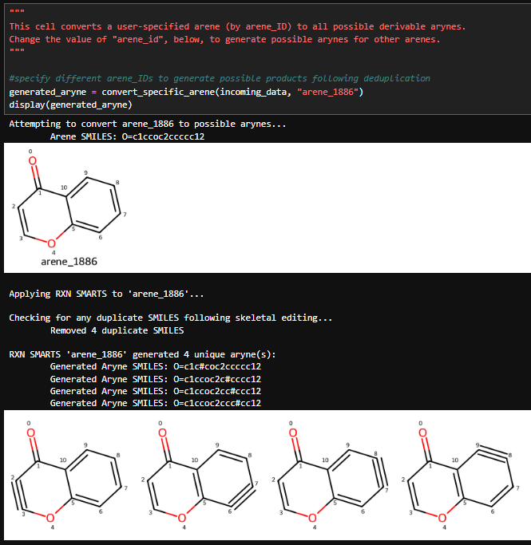
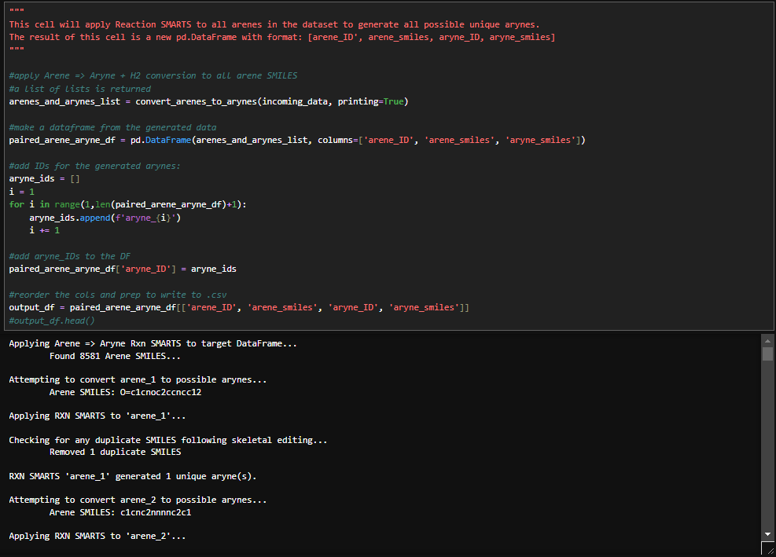
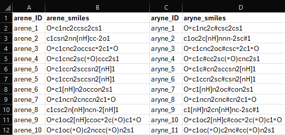

### 'Generate_Arynes_From_Arenes.ipynb' - @GCH v1.0 - last updt. 05/01/2026

### Notebook Overview:
This notebook contains code to generate Aryne SMILES strings from Arene SMILES. A Reaction SMARTS defintion is applied 
to all valid mols extracted from an incoming Pandas DataFrame's 'smiles' column, generating all possible Aryne SMILES. 
The newly minted Aryne SMILES and Aryne_IDs (ex: aryne_12) are appended to a new Pandas DataFrame and written to a an
output .csv file: 'Arenes_and_Generated_Arynes.csv' that is written to the /Module3 directory. 

### Motivation:
A robust and transparent means of generating all possible arynes from a parent arene. Generate SMILES and prepare for DFT campaign. 

### How to Use this Notebook: 
1. Define relevant Paths to output files in the PATH cell below
2. Run all cells in the notebook
3. Some cells are "interactive" in the sense that you can render specific arenes/arynes

### Generating Arynes from Arenes via Reaction SMARTS: 

### Generating Arynes from Arenes en masse: 

### Arene and Aryne SMILES output to .csv: 

