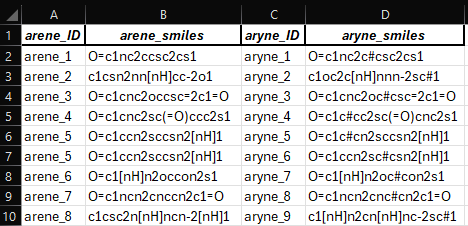
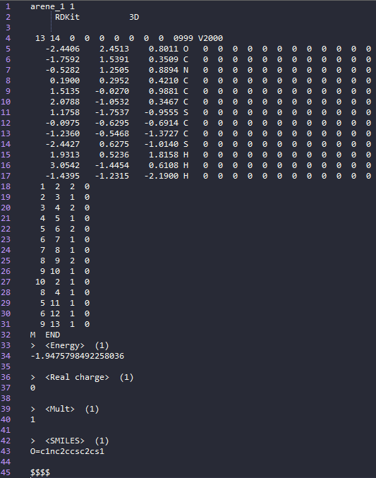
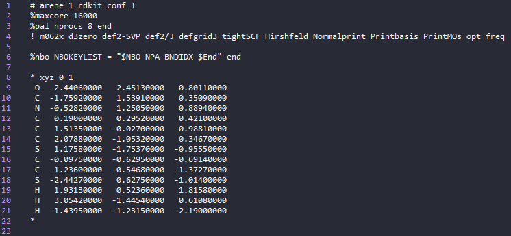
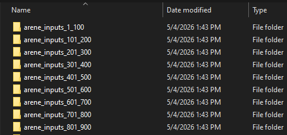
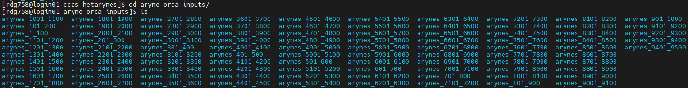
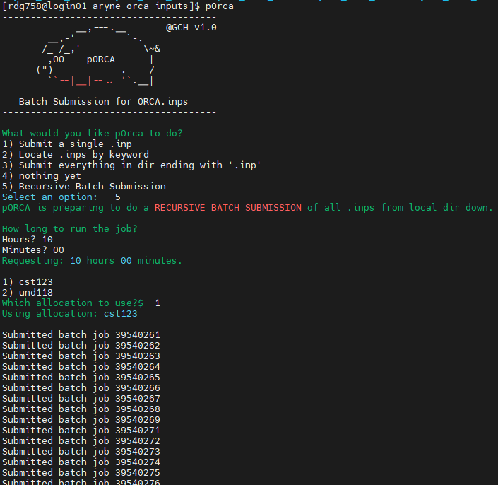
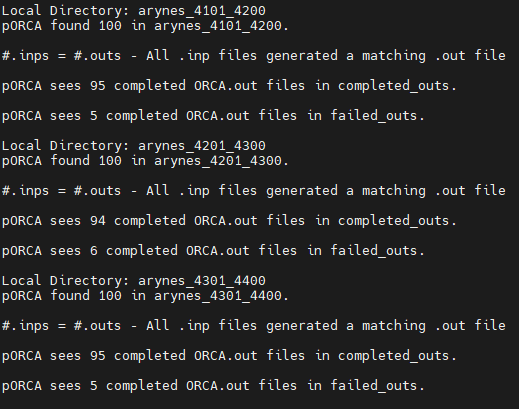

"""
### 'Generate_Conformers_Write_DFT_Inputs.ipynb' - @GCH v1.0 - last updt. 05/10/2026

### Notebook Overview:
This notebook contains code to obtain initial 3D geometries/conformers from SMILES data, generate
DFT input files (Orca 5.0.3, M06-2X-D3/def2-SVP, .inp), and batch .inps for submission to an HPC.
You can then submit en masse via a SLURM-based manager (for ex: via pOrca). Output jobs should 
then be processed locally for validation (for ex: via the "Bacon" notebooks in this project). 

### Motivation:
A mostly hands-off means of going from SMILES => Orca DFT input files

### Specifics of the Workflow in this Notebook:
- Initially SMILES are converted to 3D coordinates using CSEARCH (rdkit-based embedding).
- For any valid SMILES string that can't generate a 3D geometry, generally arynes, we use
  OpenBabel/Pybel to generate a desperate attempt for a set of 3D coordinates (see note). 

### A Note on Conformer Generation:
In this phase of the project, hetarynes are generally planar/fused and feature no substituents. 
Accordingly, we can get away with very generic conformer handling (ie, just generate a set of coords
and use those as starting points for DFT optimization). Future versions of this code will have much 
more powerful/robust means of generating conformers and selecting which to use for DFT-input files. 

### Planned Features:
1. Remove CSEARCH Dependency (slow/replace with xTB/GOAT/something else)
2. Remove QPREP Dependency (doens't handle absolute pathlib paths so need to use rel paths/import os; annoying)
3. Improve conformer generation/workflow/variability (in tandem with #1 above)
4. Eventually expand to other job types (vs. just opt+freq / more dynamic vs. a static option only)

### How to Use this Notebook: 
1. Define relevant Paths to output files in the PATH cell below
2. Define DFT Job Parameters
3. Run all cells in the notebook
"""

### Format of Input Data (.csv):

### Example .sd-file (Following SMILES --> 3D Coord. Conversion):

### Example DFT Input File (Orca Opt+Freq, Hirshfeld Charges, NBO, MOs):

### Bundling DFT Calculations in 100-job Batches:

### Upload Prepared Files/Directories to a SLURM-based HPC:

### Batch DFT Submission (via pORCA):

### Processing DFT Outputs (via pORCA):

