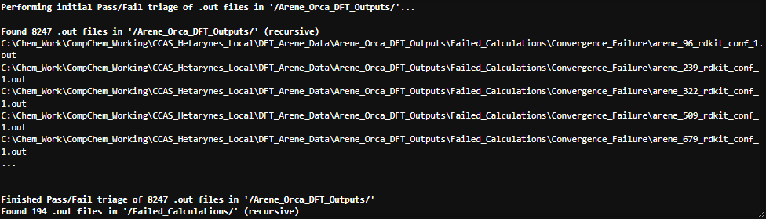
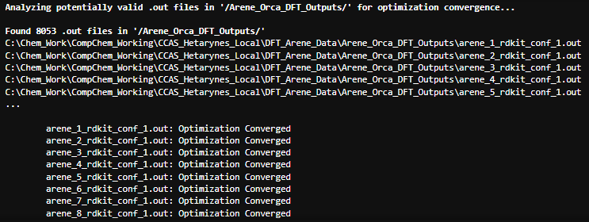
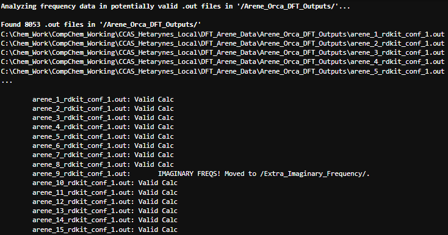
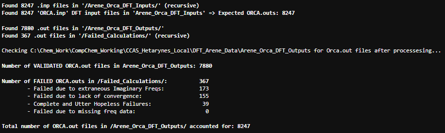
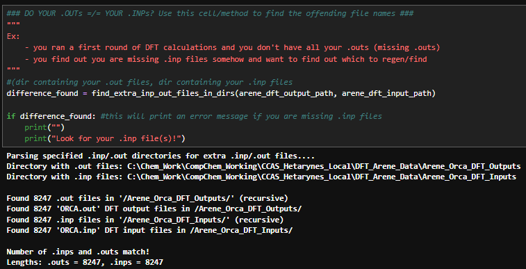
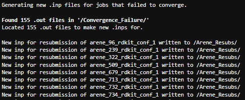
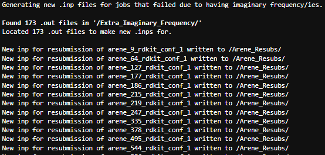

          __      _.._       ___        _.._               _     
       .-'__`-._.'.--.'.__.-'.--.`-._.''.--. '._.,        | | 
      /--'  '-._.'    '-._.'' __ '-._.' ._.  '._./        | |__   __ _  ___ ___  _ __ 
     /__.--._.--._.'``-.__.''`  '`-.__.'   '--._/         | '_ \ / _` |/ __/ _ \| '_ \ 
     '._.-'-._.-._.-''-..'._.-''-..''-..''-.__.'          | |_) | (_| | (_| (_) | | | | 
             @GCH v1.0 - last updt. 05/04/2026            |_.__/ \__,_|\___\___/|_| |_|

### Notebook Overview:
This notebook contains code to process ORCA 5.0.3 output (.out) files. 'Successful' jobs correspond to converged optimized geometries
with zero imaginary frequencies. 'Failed Jobs' are triaged based on common calculation outcomes, ex: failed convergence, failed to
terminate, presence of imaginary frequences. 

### Planned Features:
1. Implement a better/more intelligent means of resetting jobs that failed to converge (analysis of failure cause)
2. Update to parse Orca 6.x file format

### Motivation:
A lightweight and modular local Orca.out parser without any external comp chem dependencies (ex: no cclib)

### How to Use this Notebook: 
1. Define relevant Paths to output files in the PATH cell below
2. Download all .out files from an HPC to the relevant output paths (see example, below)
3. Run the notebook from the top-level project directory to process/sort .out files
4. There are also cells below to regenerate new .inp files from failed/non-converged first-run calculations - an area for improvement

#### Example:
I have 1 dir for aryne .outs (/project_dir/aryne_ORCA_ DFT_Outputs/) and 1 dir for Aryne .outs (/project_dir/aryne_ORCA_ DFT_Outputs/). I define paths in the ### PATHS ### cell below to indicate that these two dirs contain my .out files that I want to process. I run the cells below on each of my two target directories. After, each dir (arynes/arynes) will contain validate '.outs' and a subdir called /failed_calculations. Within /failed_calculations, there are subdirs for jobs that failed due to different reasons.

### How Bacon processes .out files:
1. First pass, the 'sort_complete_fail_jobs_orca5()' method sorts jobs according to the ending text in the .out file:
    - 'Normal Termination' - either completed calcs or those that ended in failed convergence
        - Normal termination/no errors - stay in top level dir/don't move file
        - Normal termination/failed convergence - move .outs to /project_dir/Aryne_ORCA_ DFT_Outputs/convergence_failure/ 
    - Failed/No 'Normal Termination' => sent to /project_dir/Aryne_ORCA_ DFT_Outputs/failed_calculations" for manual
        triage - usually these are just genuinely bad calculations.
      
2. There is next an explicit check for optimization convergence with the 'did_optimization_converge()' method. This is a True/False check.

3. Third pass evaluates the putatively "good" calculations and performs an imaginary frequency check.
    - does_out_contain_freq_data() method checks the 'normal termination' jobs for text flags indicating a frequency calc. was
        performed
    - get_orca5_freqs() method extracts the last freq block from the .out file 
    - has_imaginary_freqs_check() method analyzes extracted freqs for imaginary values

End result should be a top-level dir containing validated .out files and subdirs containing calcs that failed due to various
reasons. Can resubmit these jobs as-needed and re-process.

## Example Notebook/Processing Output:
### Initial Pass/Fail Triage:

### Explicit Optimization Convergence Check:

### Check for Extraneous Imaginary Frequencies:

### Summarize Processing Results:

### Isolate Missing (Expected) Out Files:

### Reset Jobs that Failed Due to Convergence Issues:

### Reset Jobs that Failed Due to Extraneous Imaginary Frequencies:

