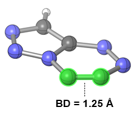

### Notebook Overview: 'Extract_Descriptors_from_DFT.ipynb'
Written by @GCH v1.0 - last updt. 04/01/2026

This notebook contains code to extract DFT-derived quantitative and qualitative descriptors from validated Orca Aryne.out files.
The extracted/calculated descriptors are written incrementally to a Pandas DataFrame called "working_df" before being written
to the local directory as "Aryne_Calculated_Molecular_Descriptors.csv". Two additional csv files are also written to the local
directory: "6_Membered_Calculated_Molecular_Descriptors.csv" and "6_Membered_Calculated_Molecular_Descriptors.csv" containing 
only 6- or only 5-membered Arynes, respectively. 

### Planned Features:
1. Ensure all methods are fully commented/have complete documentation
2. Better Error-Handling/exceptions
3. Add more/better descriptors

### Quantitative/Qualitative Molecular Descriptors Calculated by this Notebook:
1. Size of Aryne Ring - what is the number of atoms comprising the ring that the aryne C#C is in?
2. Fused or Monocyclic Aryne - Is the aryne in a monocyclic or multicyclic (fused) system?
3. Aryne Atom Indices - the 0-indexed indices of atoms comprising the C#C aryne bond.
4. Aryne Bond Atom Types - Both are C#C by definition but it's useful as a cell for future/other projects.
5. Aryne Bond Distance - the distance, in Angstroms, of the aryne C#C bond.
6. Aryne Bond Angle Indices - the 0-indexed atom indices of the C#C-X angle(s).
7. Aryne Neighbor Atom Types - the atom types of the aryne bond angles, ex: C#C-X => [C, C, X]
8. Aryne Bond Angles - the internal bond angles around the aryne bond, ex: C#C-X, in degrees.
9. Max Aryne Bond Angle - the larger of the two calculated bond angles comprising the aryne bond, in degrees.
10. Max Deviation of Bond Angle - The largest angle deviation from an equilateral polygon's ideal angles
11. Sum of Abs. Deviation - the sum of both bond angles' absolute deviation from an ideal polygon
12. Aryne Dihedral Angle - the dihedral angle, in degrees, of the X-C#C-Y dihedral angle.
13. HOMO/LUMO Energies - in eV or Hartrees, the DFT-energies of the FMOs.
14. Aryne Hirshfeld Charges - the Hirshfeld charge of each aryne C atom.
15. Sum of Abs Hirshfeld Charge - the absolute charge summed across both C#C carbon atoms. 

### How to Use this Notebook:
1. Define relevant Paths to necessary files in the PATH cell, below.
2. Define relevant output Paths for new files to be written to in the PATH cell, below.
3. Run all cells in the notebook to generate molecular descriptors and add them to a dataframe
4. An output .csv containing the calculated molecular descriptor data is written to the local dir
5. Output .csvs are separately generated for 5- and 6-membered Arynes and written to the local dir

### Example:
I just used the previous module to calculate dehydration energies for all of my arenes and arynes. I now pass the
relevant directories containing aryne.outs, xyzs, and sdfs in the cell, below. Running each of the following cells
will populate a "working_df" Pandas DataFrame with calculated descriptors extracted from various files. At the end
of this process, several output .csvs containing extracted parameters are written to the local directory. For more
details, see the specific inputs/outputs, below. 

### Program Inputs/Outputs:
#### Input: 
1. Directory containing Orca 5.0.3 DFT output files (opt+freq; M06-2X-D3 / def2-SVP)
2. Directories for .xyzs and .sdfs extracted from the above .out files (made with previous Notebook)
3. "Calculated_Dehydrogenation_Energies.csv" - a .csv containing arenes/arynes and DFT-energies

#### Output:
1. "Aryne_Calculated_Molecular_Descriptors.csv" - all calculated descriptors and dehydration energies
2. "5_membered_Calculated_Molecular_Descriptors.csv" - Descriptors for 5-memebered hetarynes, only
3. "6_membered_Calculated_Molecular_Descriptors.csv" - Descriptors for 6-memebered hetarynes, only

## Descriptor Definitions:
1. Size of Aryne Ring - what is the number of atoms comprising the ring that the aryne C#C is in?

