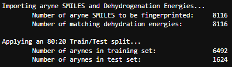
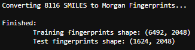
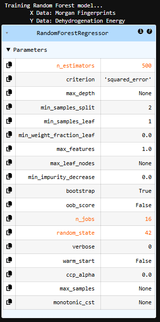
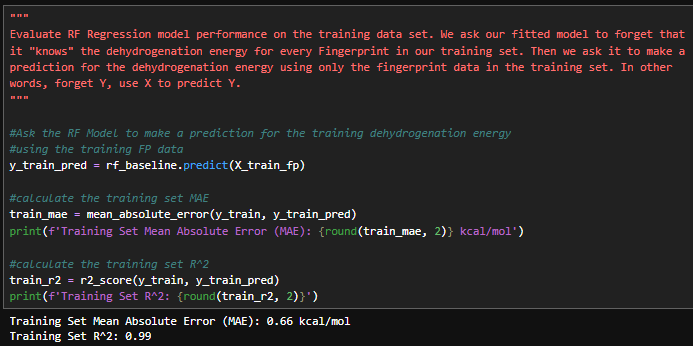
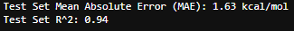
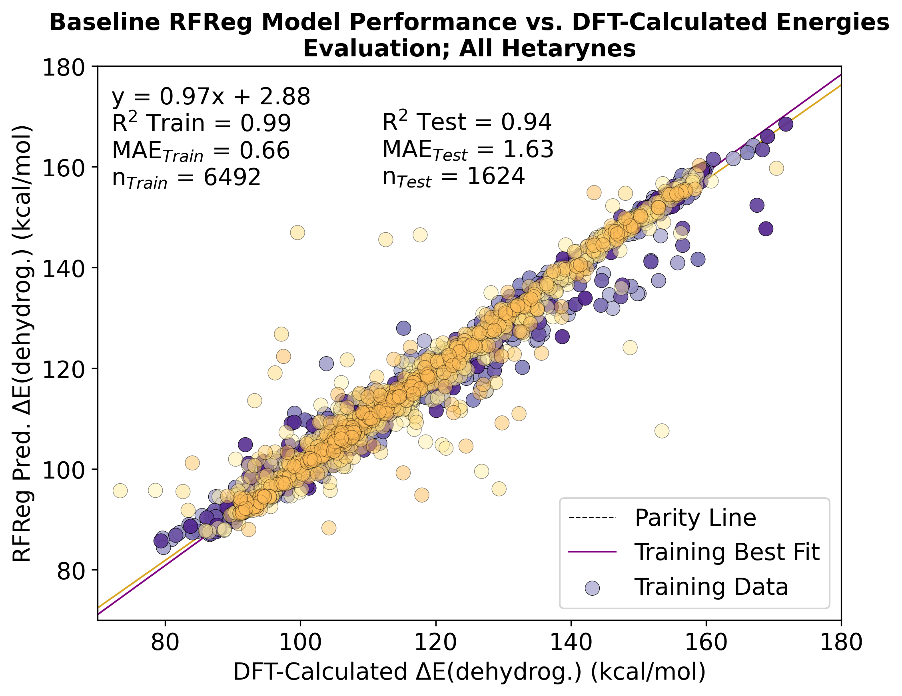

### 'RF_Regressor.ipynb' - @GCH v1.0 - last updt. 05/11/26

### Notebook Overview:
This notebook contains python code to build a baseline Random Forest (RF) Regression ML model. The model 
is trained on Morgan Fingerprints of Aryne SMILES strings to predict DFT-calculated Dehydrogenation Energies
(The energy of the reaction: Arene ==> Aryne + H2). The motivation of this approach is to establish how well 
a failry "naiive" ML model, trained using only SMILES and DFT-calculated energies, can predict the energy of
dehydrogenation for unseen arynes. 

### Motivation:
An all-in-one Jupyter Notebook for building a Random Forest Regression model for predicting dehydrogenation
energies.

### Details on Morgan Fingerprints:
Morgan Fingerprints are obtained from SMILES strings by:
1. Converting SMILES strings to RDKit Mol objects
2. Employing RDKit's rdFingerprintGenerator method to obtain a binary ExplicitBitVect (bit vector) for the SMILES
3. Converting fingerprint bit vectors to numpy arrays

### How to use this Notebook:
1. Define the relevant paths and directories, below.
2. Run all cells in the notebook.
3. Local directory will contain .png files for the generated scatterplots.

### Key Notebook Operations:
#### Import Data and Apply Train/Test Split:

#### Convert SMILES to Morgan Fingerprints:

#### Train a Random Forest Regression Model:

#### Evaluate Model Performance on Training Data:

#### Evaluate Model Performance on Held-Out Test Data:

#### Visualize RF Regressor Model Performance:

