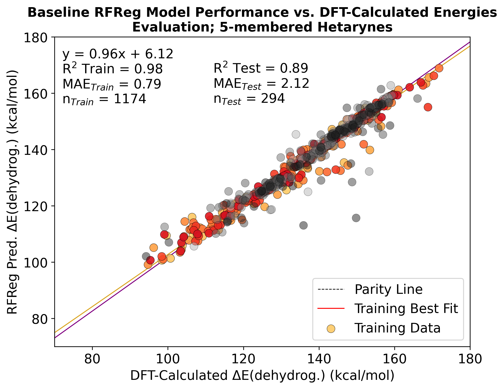
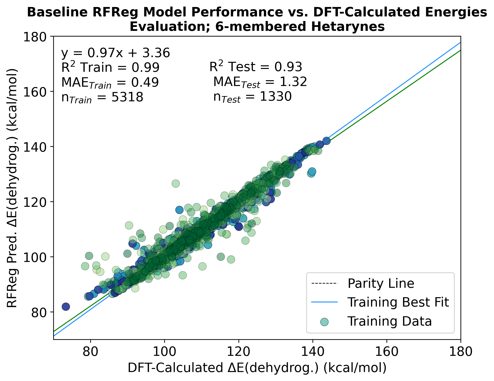

### 'RF_Regressor_5-Mem_Hetarynes.ipynb' - @GCH v1.0 - last updt. 05/11/26

### Directory Overview:
This directory contains 2 distinct Jupyter Notebooks for building Random Forest Regression models for both
5- and 6-membered hetarynes. The Models are trained on Morgan Fingerprint data obtained through RDKit and 
fit to predict DFT-calculated Dehydrogenation Energies.

### Example Output:

#### 5-Membered Hetarynes:

#### 6-Membered Hetarynes:

