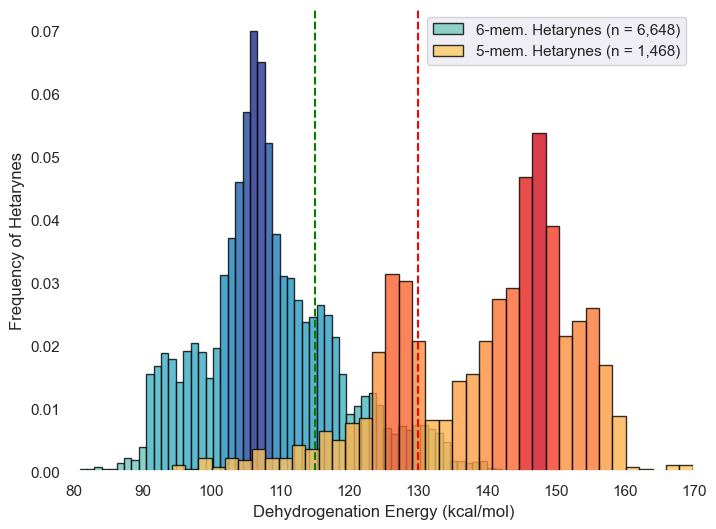
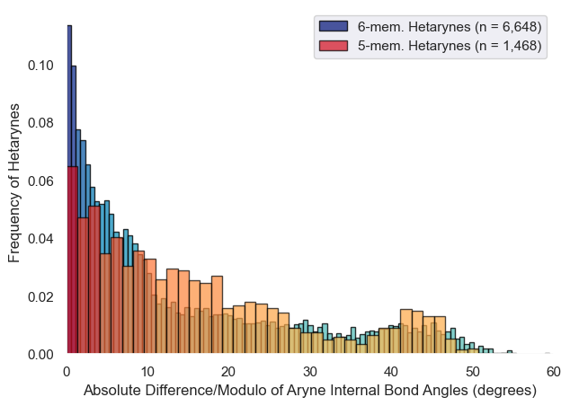

### Directory Overview:
This directory contains Jupyter Notebooks used to render histograms of arynes by DFT-calculated dehydrogenation energies.

### These notebooks rely on the descriptor-containing .csv files located in the Module 7 directory:
- "Aryne_Calculated_Molecular_Descriptors.csv"
- "5_membered_Calculated_Molecular_Descriptors.csv"
- "6_membered_Calculated_Molecular_Descriptors.csv"

### Aryne Ring size vs. DFT-calculated dehydrogenation energy:

### Arynes by difference in bond angle across aryne bond:

