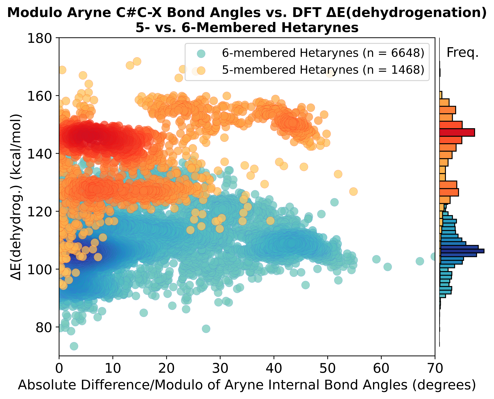

### '5_vs_6_mem_Hetarynes_Univariate_Scatter_Plots.ipynb' - @GCH v1.0 - last updt. 05/11/26

### Notebook Overview:
This notebook is the ring-size-split counterpart of [`../All_Hetarynes/`](../All_Hetarynes/README.md): it generates univariate scatterplots of each quantitative molecular descriptor against the DFT-calculated dehydrogenation energy ΔE(Arene → Aryne + H₂), but color-codes the points by ring size so that 5- and 6-membered hetarynes can be compared at a glance. Marginal histograms on both axes show the joint distribution per ring size.

Reads:
- `5_membered_Calculated_Molecular_Descriptors.csv` (Module 7 output)
- `6_membered_Calculated_Molecular_Descriptors.csv` (Module 7 output)

Writes:
- One `.png` per descriptor to the local directory (e.g., `5_vs_6_Aryne_HOMO-LUMO_Gap_vs_dEdehyd_with_histos.png`).

### Motivation:
Do 5- and 6-membered hetarynes show different descriptor–energy relationships? Visually separating the two ring sizes can reveal whether a single descriptor is a good predictor across the whole dataset or only within one ring class — which informs whether a unified or split ML model is appropriate (see [`../../ML_RF_Regression_Models/Split_by_Ring_Size/`](../../ML_RF_Regression_Models/Split_by_Ring_Size/README.md)).

### How to use this Notebook:
1. Define the relevant paths to the Module 7 descriptor .csv files in the PATH cell.
2. Run all cells in the notebook.
3. The local directory will contain one `.png` per descriptor.

### Example Output: aryne bond-angle asymmetry (|ΔBA|)

---

<!-- nav-footer -->
⬅ Previous: [Module 7 — Extract Molecular Descriptors](../../../Module7_Extract_DFT_Molecular_Descriptors/README.md)
