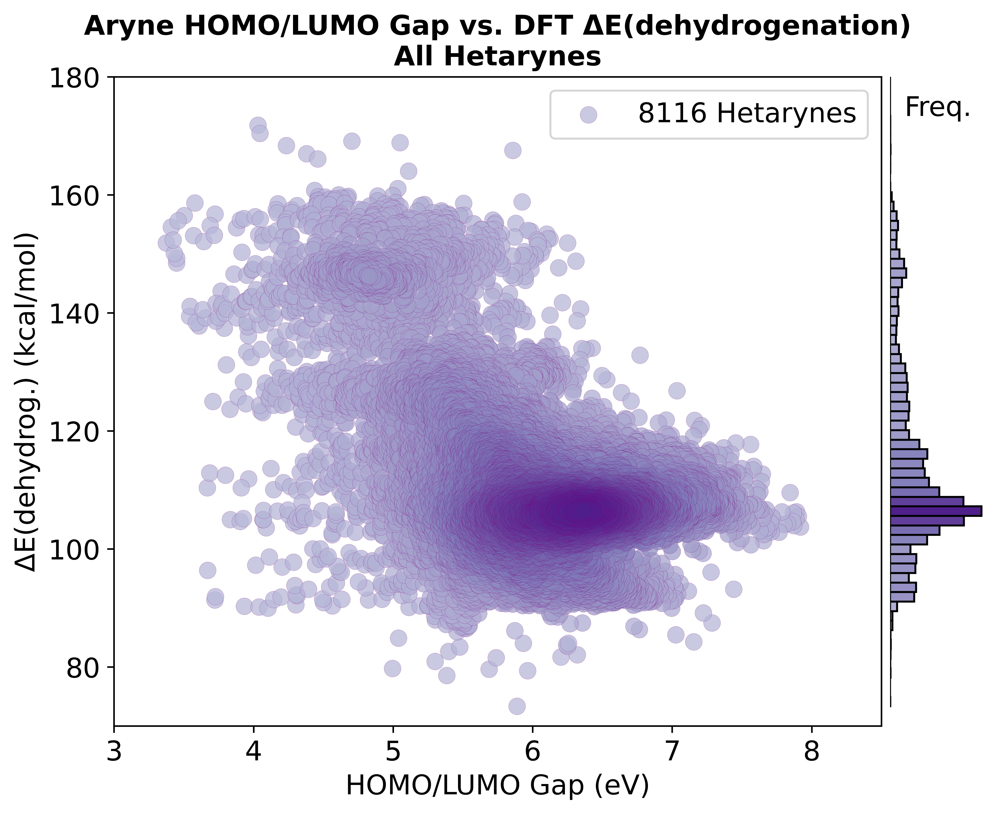

### 'Unified_Univariate_Scatter_Plots.ipynb' - @GCH v1.0 - last updt. 05/11/26

### Notebook Overview:
This notebook generates univariate scatterplots of each quantitative molecular descriptor (extracted by Module 7) against the DFT-calculated dehydrogenation energy ΔE(Arene → Aryne + H₂). All ~8,116 hetarynes in HAL-8000 are plotted together (no ring-size split). Each plot includes marginal histograms on both axes to show the joint distribution.

Reads:
- `Aryne_Calculated_Molecular_Descriptors.csv` (Module 7 output)

Writes:
- One `.png` per descriptor to the local directory (e.g., `Unified_Aryne_HOMO-LUMO_Gap_vs_dEdehyd_with_histos.png`).

### Motivation:
Is there a clear single descriptor that correlates strongly with ΔE? If so, the project might use it directly as a predictor without needing fingerprint-based ML. The scatterplots also surface visual outliers worth investigating individually.

For the ring-size-split counterpart of this notebook, see [`../5_vs_6-Membered_Hetarynes/`](../5_vs_6-Membered_Hetarynes/README.md).

### How to use this Notebook:
1. Define the relevant paths to the Module 7 descriptor .csv file in the PATH cell.
2. Run all cells in the notebook.
3. The local directory will contain one `.png` per descriptor.

### Example Output: HOMO-LUMO Gap (eV)

---

<!-- nav-footer -->
⬅ Previous: [Module 7 — Extract Molecular Descriptors](../../../Module7_Extract_DFT_Molecular_Descriptors/README.md)
