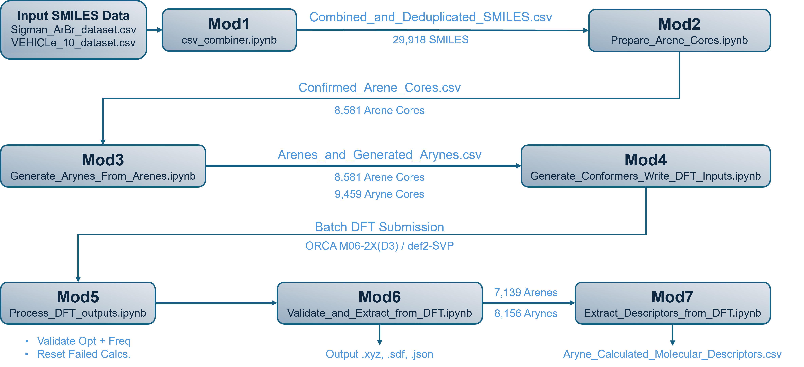
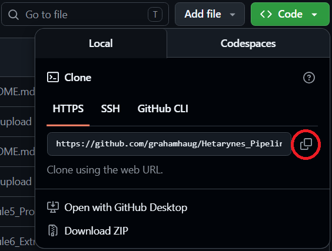
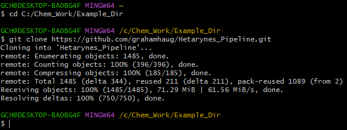
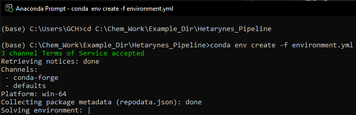
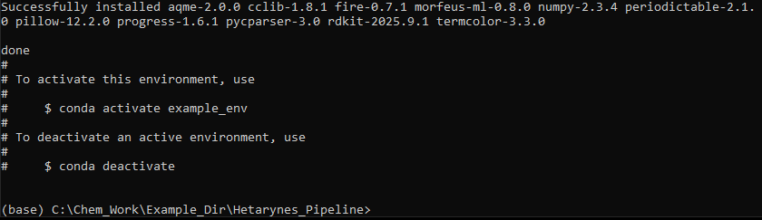
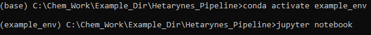
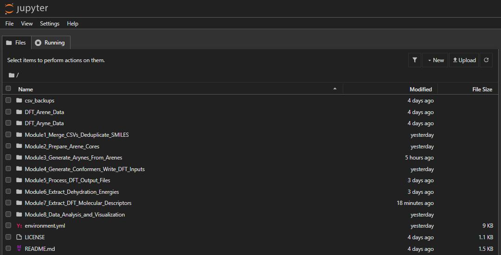

# Hetarynes_Pipeline
@GCH - Last Updated: 05/17/26
- 05/17/26: Merged ImplementationPlan branch with Main; added FigShare dataset.
- 05/12/26: Added Installation Guide, Workflow Schematic
- 05/11/26: Added RF Regression Models, Updated main README.md. 

## Project Overview
<div style="text-align: justify;">
The primary motivation of this project is the curation of the "HAL-8000" computational dataset of structures and quantitative molecular descriptors for synthetically accessible heterocylic arynes (hetarynes). The dataset enables data-driven statistical analyses across the range of accessible hetaryne chemical space, furnishing high-level quantitative insights which may allow for both advances in synthetic/methodological development and predictive modeling.

This material is based upon work supported by the U.S. National Science Foundation under the NSF Center for Computer Assisted Synthesis (C-CAS), grant number CHE–2202693. 
</div>

## Table of Contents:
* [Project Overview](#project-overview)
* [Quickstart (5 minutes, no DFT)](#quickstart-5-minutes-no-dft)
* [How to Cite](#how-to-cite)
* [Workflow Description](#workflow-description)
* [Coding and Design Principles](#coding-and-design-philosophies)
* [Installation Guide](#installation-and-configuration)
* [The HAL-8000 Dataset](#the-hal-8000-dataset)
* [Intended Future Features](#intended-future-features-and-updates)
* [Workflow Visual Schematic](#schematic-of-workflow)

## Quickstart (5 minutes, no DFT):

After completing the [Installation](#installation-and-configuration) steps, launch Jupyter from the project root and open [`examples/quickstart.ipynb`](examples/quickstart.ipynb):

```bash
conda activate hetarynes_env
jupyter notebook examples/quickstart.ipynb
```

Run all cells. The notebook takes 10 sample heteroaromatic SMILES through Modules 1 → 3 of the pipeline (SMILES validation → core filtering via SMARTS → aryne generation via Reaction SMARTS), renders the resulting arynes inline with RDKit, and completes in under 30 seconds on a laptop. No DFT calculations, no HPC access required.

This is the recommended way to verify your install and to get a feel for the pipeline before tackling the full DFT workflow (Modules 4 → 7).

## How to Cite:

If you use this software or the HAL-8000 dataset in your research, please cite both the code repository and (once minted) the Zenodo archive. GitHub renders a "Cite this repository" widget in the sidebar of the repo home page from the [`CITATION.cff`](CITATION.cff) file.

<!-- Once a Zenodo DOI is minted (see release process), add a badge here:
[](https://doi.org/10.5281/zenodo.XXXXXXX)
-->
Access the HAL-8000 DFT Structural dataset here:

<div align="center">
  [](https://figshare.com/articles/dataset/HAL-8000_DFT_Structural_Dataset/32305362)
</div>

BibTeX:
```bibtex
@software{hetarynes_pipeline_2026,
  title   = {Hetarynes\_Pipeline: HAL-8000 hetaryne dataset curation workflow},
  author  = {Haug, Graham and Davis, Benjamin and Kisunzu, Jessica and Biswas, Dalia and Paton, Robert S.},
  year    = {2026},
  url     = {https://github.com/grahamhaug/Hetarynes_Pipeline},
  version = {1.0.0},
  license = {MIT}
}
```

## Workflow Description:
We have developed an easy-to-use and freely available end-to-end workflow in the form of Jupyter Notebooks to:
- [Mod1](./Module1_Merge_CSVs_Deduplicate_SMILES/README.md) - Extract, validate, and deduplicate SMILES strings from multiple .csv datasets
- [Mod2](./Module2_Prepare_Arene_Cores/README.md) - Perform SMARTS-based skeletal editing and post-editing structural validation using RDKit
- [Mod3](./Module3_Generate_Arynes_From_Arenes/README.md) - Use Reaction SMARTS to generate all possible hetarynes from parent hetarynes
- [Mod4](./Module4_Generate_Conformers_Write_DFT_Inputs/README.md) - Convert SMILES => 3D coordinates => Orca DFT input files => Batch for HPC Submission/Processing
- [Mod5](./Module5_Process_DFT_Output_Files/README.md) - Validate DFT output files, identify and reset failed DFT calculations, and extract energies
- [Mod6](./Module6_Extract_Dehydration_Energies/README.md) - Extract user-defined quantitative/qualitative molecular descriptors to .csv
- [Mod7](./Module7_Extract_DFT_Molecular_Descriptors/README.md) - Collate molecular descriptors for training and prepare for univariate analysis
- [Mod8a](./Module8_Data_Analysis_and_Visualization/Plot_Histograms_of_Dehyd_Energies/README.md) - Analyze thermodynamic accessibility of hetarynes in HAL-8000
- [Mod8b](./Module8_Data_Analysis_and_Visualization/Plot_Univariate_Scatterplots/5_vs_6-Membered_Hetarynes/README.md) - Perform Univariate statistical analysis of extracted molecular descriptors
- [Mod8c](./Module8_Data_Analysis_and_Visualization/ML_RF_Regression_Models/README.md) - Train and Evaluate RF Regression ML Models using Morgan Fingerprints

## Coding and Design Philosophies:
<div style="text-align: justify;">
  
Our intention is to release highly generalizable and well-documented code to the broader chemical community. Accordingly, the Jupyter Notebooks in this project are intended to serve as on-the-job training tools for new student orientation/training or for individuals looking to expand their own skillsets. To that end, the notebooks are extensively commented throughout to illustrate key inner workings of the code. Any helpful suggestions or improvements are welcome, ideally in line with the MO below:

1. Notebooks should be easy to use regardless of technical background/proficiency.
2. Workflow encourages hands-on/human in-the-loop interaction at key points. 
3. Workflow steps should be completely transparent in purpose and execution.
4. Documentaton/Commenting is a priority to consolidiate knowledge in one source.
5. Notebooks should be modular and readily generalizable to other projects.
6. Notebooks rely on minimal outside dependencies (fewer installs/more robust to external updates).
7. Workflow should be extendable to other Electronic Structure Packages/Levels of Theory/MLIPs.
</div>

## The HAL-8000 Dataset:

<div style="text-align: justify;">
The code herein has been used to curate the Heteroaromatic Aryne Library (HAL)-8000. This dataset includes DFT-level structures (M06-2X(D3) / def2-SVP) for 7,143 heterocyclic arenes, 8,116 derived heterocyclic arynes, 8116 DFT-calculated dehydrogenation energies (the energy required to access an aryne, Arene ==> Aryne + H2), and extracted molecular descriptors. DFT-optimized structures are retained as both .xyz and .sdf formats while the tabulated data are retained as .csv files.

Access the DFT Structural Dataset (.inp, .out, .xyz, .sdf) here:

<div align="center">
  
  [](https://figshare.com/articles/dataset/HAL-8000_DFT_Structural_Dataset/32305362)
  
</div>


## Intended Future Features and Updates:
1. More robust conformational searching/handling prior to Orca.inp generation (ex: CREST/GOAT/etc.)
2. Allow for DFT calculations to performed with different levels of theory
3. Additional options for Orca.inp creation for other common job types (scan/TS opt/etc.)
4. Better integration with the pOrca SLURM manager package for iterative submission(s).
5. Expand into MLIP-based workflows
6. Conformational ensembles/analysis

## Schematic of Workflow:

<div align="center">
  
</div>

## Installation and Configuration:
1. [Install Git](https://git-scm.com/install/) based on your operating system
2. [Install Miniconda](https://www.anaconda.com/docs/getting-started/miniconda/install/overview) (or Conda) based on your operating system
3. On the GitHub Repository page, click the green "Code" button and click the icon shaped like two overlaid boxes (circled below in green) to copy the repository URL:
<div align="center">
  
</div>

4. Open a terminal (Git Bash on Windows, Terminal on macOS, or any shell on Linux) and navigate to a directory you'd like to store the project/notebooks. On Windows the example below uses `C:/Chem_Work/Example_Dir`; macOS/Linux users can use any writable path (e.g. `~/Chem_Work/Example_Dir`):
```bash
cd C:/Chem_Work/Example_Dir
```

5. Use git to clone the copied repository URL - this will place a "Hetarynes_Pipeline" directory containing this project repo in your specified directory:
```bash
git clone https://github.com/grahamhaug/Hetarynes_Pipeline.git
```

<div align="center">
  
</div>

6. In an Anaconda prompt (Windows) or terminal (macOS/Linux), navigate to the newly created path using `cd` and create a new conda environment from the included environment file.

   **Windows:** use the fully-pinned [environment.yml](environment.yml):
```bash
cd C:\Chem_Work\Example_Dir\Hetarynes_Pipeline
conda env create -f environment.yml
```

   **macOS / Linux:** use the portable [environment-portable.yml](environment-portable.yml) instead — the Windows lockfile pins build hashes that don't resolve on other platforms:
```bash
cd ~/Chem_Work/Example_Dir/Hetarynes_Pipeline
conda env create -f environment-portable.yml
```

<div align="center">
  
</div>

<div align="center">
  
</div>

7. After the new conda environment and required software is configured, activate the environment:
```bash
conda activate hetarynes_env
```

```bash
jupyter notebook
```

<div align="center">
  
</div>

> **macOS PATH note:** AQME's `csearch` calls the `obabel` command-line binary as a subprocess, so the conda env's `bin/` must be at the **front** of your shell `PATH`. On most setups `conda activate hetarynes_env` handles this automatically, but if you have a `.zshrc` / `.bash_profile` that re-prepends a system Python path (e.g. `/Library/Developer/CommandLineTools/...`), AQME will silently exit with `"Open Babel is not installed!"`. Verify with `which obabel` after activating — it should point inside `…/envs/hetarynes_env/bin`. If it doesn't, prepend manually: `export PATH="$CONDA_PREFIX/bin:$PATH"`.

8. Finally, use the Jupyter interface to freely manage/run the Notebooks from your machine:

<div align="center">
  
</div>


